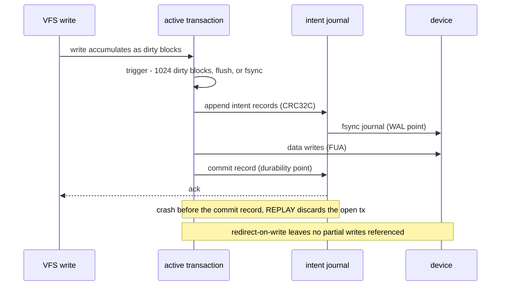

# Transactions Specification

*This specification is planned for a future Phase of LionFS.*

## Commit sequence (design)

The batching discipline the VFS implements ([vfs.md](vfs.md): writes
accumulate in `active_tx`, commit at more than 1024 dirty blocks, on
flush, or on fsync) and the engine drives through group commit
([io_engine.md](io_engine.md)):

A writer needing isolation takes a private batch — the $n = 1$ case,
paying its own flush.

## Two-phase cost

Journal-then-data: costs additive per transaction, amortized across the
batch:

$$T_{\text{commit}} = \frac{J}{B_{\text{seq}}} + \frac{D}{B} +
c_{\text{fsync}}, \qquad T(n) = \frac{\sum_i J_i + \sum_i D_i}{B} +
c_{\text{fsync}}$$

$$T_{\text{per-tx}}(n) = \frac{J + D}{B} + \frac{c_{\text{fsync}}}{n}$$

— the amortization group commit exists for (5 ms / 1 MiB windows). The
intent log records redirects rather than data payloads, so $J \ll D$
and the write amplification per transaction stays near one:

$$\mathrm{WAF}_{\text{tx}} = \frac{J + D}{D} = 1 + \frac{J}{D} \approx 1$$