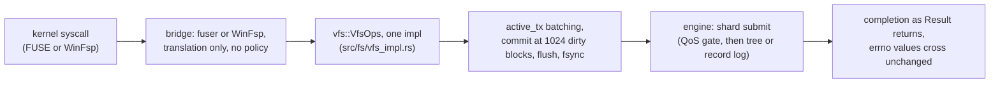

# Specification: The VFS Operations Surface (LionFS 2.0)

Status: implemented (`src/vfs/`, `src/fs/vfs_impl.rs`) | RFC: LFS-RFC-003 §5

## One semantics, many bridges

The core engine implements **one** operations trait; every mount
technology is a translation layer over it:

```text
LionFS (core) ──impl──▶ vfs::VfsOps ──bridges──▶ fuser (Linux, macOS)
                                       └───────▶ WinFsp (Windows, per RFC-003 §5)
```

This replaces the 1.x `impl fuser::Filesystem for LionFS`, which
welded the engine to Linux FUSE. The port was mechanical and 1:1:
every 1.x method body moved to `fs::vfs_impl` with `reply.*` callbacks
becoming `Result` returns and `libc::` constants becoming `pal::posix`
constants. Semantics cannot drift between platforms because there is
nothing to drift — one impl.

## The surface

`VfsOps` mirrors the FUSE ABI name-for-name (plus `init`/`destroy`):

`init`, `destroy`, `lookup`, `getattr`, `setattr`, `readdir`,
`read`, `write`, `create`, `mkdir`, `unlink`, `rmdir`, `rename`,
`fsync`, `flush`, `statfs`, `access`, `readlink`, `symlink`,
`entry_ttl`.

Supporting types (all platform-neutral):

- `VfsError` — an errno number (Linux ABI values = FUSE wire values)
  with named constructors (`noent`, `io`, `nosys`, `perm`) and
  `from_io` mapping `std::io::Error` (Win32-aware on Windows).
- `VfsAttr` — the stat(2) shape; `VfsKind` (file/dir/symlink);
  `VfsDirEntry` carries the FUSE readdir offset protocol
  (`next_offset`); `VfsStatFs`, `VfsSetAttr`, `VfsCreate`.

## The FUSE bridge (`src/vfs/fuse_bridge.rs`, unix)

`FuseBridge<T: VfsOps>` implements `fuser::Filesystem` by delegation:
`TimeOrNow` resolves at entry; readdir windows fetch entries with
their next-offsets and stop on buffer-full; TTLs come from
`entry_ttl`. `vfs::fuse_bridge::mount(ops, mountpoint, options)`
serves until unmount. The CLI (`mount_lfs`), the library
(`mount::mount_and_serve`), and the C API (`lfs_mount_fuse`) all
route through this bridge — there is no second path.

## The core impl (`src/fs/vfs_impl.rs`)

The ported 1.x logic, verbatim where possible:

- the `.lfs_scrub` / `.lfs_health` virtual control files at inode
  999999/999998 (constants frozen — they are visible in mounted
  filesystems);
- transaction batching: writes accumulate in `active_tx` and commit at
  >1024 dirty blocks, on flush, or on fsync;
- cross-directory rename with the orphan-restoration rollback (entry
  re-added at source when the destination add fails);
- `rmdir` guards: target must be a directory and empty (ENOTDIR /
  ENOTEMPTY / ENOENT);
- real permission enforcement through `inode::permissions::check_access`
  with the caller's uid/gid;
- compression/encryption defaults resolved at create, keys generated
  and persisted before the TxContext borrow is in play.

Not yet implemented (surfacing `ENOSYS`, as 1.x did): `readlink` /
`symlink` — symlink first-classness in the on-disk format is the
precondition, tracked in the roadmap.

## Porting discipline

- New operations join `VfsOps` first, then every bridge.
- Bridges translate; they never make policy. A behavioral difference
  between platforms is a bug in a bridge, not a feature.
- errno values cross the bridge unchanged — they are already the wire
  ABI.

## Dispatch path (diagram)



Bridges translate; the single `VfsOps` implementation is where policy
lives — a behavioral difference between platforms is a bug in a
bridge, not a feature.

## Syscall budget decomposition

Per call, the budget is additive across the layers:

$$t_{\text{sys}} = t_{\text{bridge}} + t_{\text{vfs}} + t_{\text{tx}} +
t_{\text{io}}$$

$t_{\text{bridge}}$ is O(1) — delegation and errno mapping, no copies
beyond the FUSE ABI's own; $t_{\text{vfs}}$ is the ported 1.x logic
(lookup, permission check, extent resolution). The batched terms
amortize: commits fire at more than 1024 dirty blocks, so under
sustained writes each commit's cost divides over the batch,

$$t_{\text{commit per block}} = \frac{c_{\text{fsync}} +
c_{\text{journal}}}{1024}, \qquad
t_{\text{io}} \approx \frac{\bar p}{B} + \frac{c}{n_{\text{batch}}}$$

The `.lfs_scrub` / `.lfs_health` control files are reads at fixed
inodes (999999/999998): constant cost, no transaction, no allocation.
