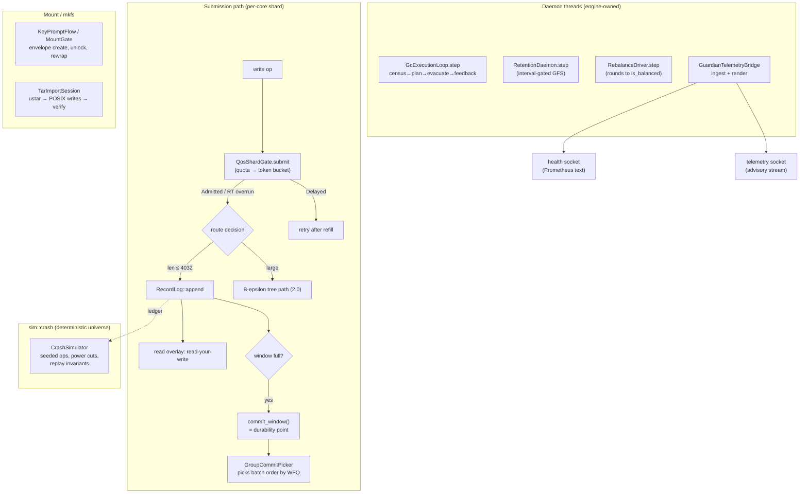
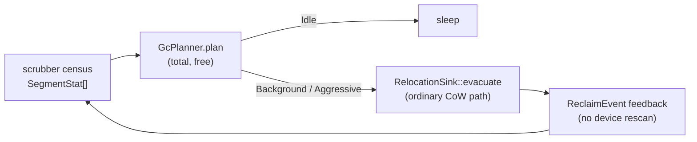

# Specification: The Phase 8 Wiring (LionFS 3.1)

Status: implemented (`src/wiring/`) | RFC: LFS-RFC-004 §15

## Why

LionFS 3.0 shipped every policy layer — QoS, the record journal,
the GC planner, GFS retention, rebalance, Guardian, Prometheus,
migration, key envelopes — as a pure, caller-supplied-time object.
Purity made them testable, but each one only *answered questions*;
nothing consulted them on a live path. Phase 8 is the wiring: each
policy object now sits on the path it governs, behind a seam narrow
enough to keep the io_uring fast path allocation-light and every
decision reproducible in the deterministic simulator.

## The wiring contract

Three rules, uniform across every seam:

1. **The engine owns the thread; the wiring owns the step.** Every
   integration point is a `step(now_ns, …)` function. Daemon threads
   call it once per wake-up; `sim::crash` calls it once per simulated
   op. Nothing under `src/wiring/` reads a clock.
2. **Deny-soft, never wedge.** Every admission decision degrades to
   defined 2.0 behavior when its budget is exhausted — a delayed
   op retries after refill; a failed GC evacuation stops the round;
   a locked mount gate refuses cleanly. No unbounded blocking on the
   submission path (RFC-004 §4.4).
3. **A/B measurable.** Each switch exposes wired-vs-bypass counters,
   so RFC-002 §2.4's "every structural change is proven with a
   benchmark" discipline applies to the wiring itself.

## QoS admission + WFQ batch pick (`qos_gate.rs`)

The shard gate composes two checks per submitted op: the namespace
quota (early rejection — a 100 GiB write into a 10 GiB namespace
must fail at submit, not at extent allocation; the allocation path
remains the charging authority), then the class's dual token
bucket. The Realtime guarantee is structural: an RT op whose bucket
is momentarily empty is **still admitted**, counted as an overrun —
the bucket meters RT, it never blocks it. BestEffort and Bulk are
strict.

Group commit's wake path faces $N$ pending queues; the picker wraps
`WfqScheduler` so batch order follows virtual finish time. Under
sustained saturation the service split converges to the weight
ratio, by construction:

$$\frac{S_i}{S_j} \;\to\; \frac{w_i}{w_j}, \qquad
\text{finish}_i = v_{\text{now}} + \frac{c_i}{w_i}$$

**Tuned profile (③):**

$$\begin{aligned}
r_{\text{RT}} &= 16\ \mathrm{GiB/s} & b_{\text{RT}} &= 1\ \mathrm{GiB} \\
r_{\text{BE}} &= 4\ \mathrm{GiB/s} & b_{\text{BE}} &= 256\ \mathrm{MiB} \\
r_{\text{bulk}} &= 1\ \mathrm{GiB/s} & b_{\text{bulk}} &= 64\ \mathrm{MiB}
\end{aligned}$$

with WFQ weights $w = (8, 4, 1)$: a bulk byte costs its queue 8× the
virtual time of a realtime byte, so RT:bulk service converges to
8:1 regardless of arrival pattern. Property tests pin the ratio to
$7.4 < S_0/S_2 < 8.6$ over 8 000 rounds.

## Small-write switch (`small_write.rs`)

The route decision is one comparison: payload $\le 4032$ B → record
log; anything larger → the tree path. The router adds three things
the 3.0 `RecordLog` lacked on the live path:

- **Window policy**: byte/record budgets (1 MiB / 256 records) flush
  the group-commit window; the engine adds the time side at its own
  tick.
- **Read overlay**: `BTreeMap<file_id, Vec<OverlayRec>>` applied in
  sequence order — read-your-write semantics; a `None` falls through
  to the tree, the ordinary 2.0 read.
- **Checkpoint drain**: when the log's `checkpoint_due` fires, the
  overlay drains through a caller-supplied sink (the transaction
  layer's tree-insert path), in global sequence order — the tree
  observes exactly the op order a post-crash replay would apply.

The window amortization, for $n$ records of average size
$\bar p$ against bandwidth $B$ and fixed per-op cost $c$:

$$T_{\text{window}} = \frac{n\bar p}{B} + c, \qquad
T_{\text{scattered}} = \frac{n\bar p}{B} + nc$$

The win is $(n-1)c$ — at $n=64$ and 20 µs NVMe per-op cost, 1.26 ms
per window.

**Crash invariant (proved in `sim::crash`)**: the overlay only
exposes records replay would apply. A record after the last `Commit`
is visible to the writer but not claimed durable; a crash discards
exactly that suffix; the post-crash overlay is rebuilt from replay,
so writer view and replay view provably converge.

## GC execution loop (`gc_loop.rs`)

QoS posture is a function of urgency only:

$$\text{class} = \text{Bulk}, \qquad
\text{rate-limited} \iff \text{urgency} = \text{Background}$$

Panic mode *stays* in Bulk class — user IO wins the queue, always —
but drops the rate limit. `run_to_health` terminates at the kick
watermark, an honest all-live `None` plan, an evacuation error, or
the round cap; it cannot spin.

**The transient-runway bound the tuned watermarks respect** (kick
25%, aggressive 10%, background reclaim rate $r$ as a fraction of
the pool per second, workload fill rate $f$): a burst with $f > r$
drains the background band and reaches panic after

$$t_{\text{panic}} = \frac{\text{kick} - \text{aggressive}}{f - r},
\qquad f \le r \ \text{never panics}$$

The 3.0 defaults (20/8) gave a 12-point band; the tuned 25/10 gives
15 — **25% more burst runway** at the same $r$, while the 10-point
panic runway below aggressive is unchanged in spirit (a 10% free
floor held in reserve).

## Retention + rebalance daemons (`retention_daemon.rs`)

The retention daemon rate-limits itself: one GFS pass per
`min_interval_ns` (default 1 h). Two passes at the same $t$ over the
same stamps produce the same keep-set (the policy is pure), so the
interval is a cache of a pure function; the sim exercises tier
boundaries by advancing the clock. Failed expirations (device
errors) are reported and retried on the next pass — a snapshot that
cannot be deleted is an operator-visible condition, never a wedge.

The rebalance driver runs one planner round per step and executes
moves through the `SegmentMover` seam; `run_to_balance` loops until
`is_balanced` or the round cap — a leaving device's drain finishes
over several ticks, not one (bulk-class IO, budget-bounded rounds).

## Telemetry bridge (`telemetry_bridge.rs`)

One object, both sockets. 19 bounded metric series (the cardinality
bound is fixed at construction — a registry that grows mid-flight is
a leak): Guardian advisories per kind with evidence gauges and the
window stall detector, QoS admitted/delayed per class, GC reclaimed
bytes and rounds, record-log routes, retention expirations,
rebalance bytes. Scrapes are deterministic (families in name order,
series sorted by label) — the simulator asserts on rendered text.

## Key envelope flow (`key_flow.rs`)

mkfs creates (passphrase → wrapped blob + live envelope); mount
unwraps with a **3-attempt budget then lockout**. The online-guess
economics at $\mu = 600{,}000$ PBKDF2 iterations:

$$T_{\text{guess}} = \frac{3\mu}{t_{\text{SHA256}}} \approx
\frac{1.8\text{M}}{10^7/\mathrm{s}} \approx 0.18\ \mathrm{s}^{-1}$$

Rotation (`rewrap`) re-wraps the master under a new passphrase
without touching it — file keys are unchanged, re-key is
metadata-only (RFC-004 §11.3). The audit trail (`KeyFlowReport`)
records every create/reject/unlock/lockout/rotation.

## Tar import session (`tar_stream.rs`)

A real ustar parser — header checksum (field counted as spaces),
magic, octal fields with `NonOctalField` rejection, GNU longname
(`L`) records, prefix composition — feeding the `ImportSink` seam
(the LionFS POSIX write path), recording the SHA-256 manifest per
file, closing with the read-back verification pass. Hardlinks and
PAX headers are counted, not materialized (the importer does not
synthesize link structure it cannot verify). Member ceiling: octal
size fields cap at $8^{11} - 1 = 8$ GiB; the 3.1 capacity plane
makes the volume unbounded — the tar path's per-member ceiling is a
format property, and `--format=pax` support is the Phase 9 follow-up.

## The deterministic crash simulator (`src/sim/`, ②)

Seeded universes (`SimRng`, xorshift64*) on a simulated clock
(`SimClock`). The workload script is a pure function of the seed:
small writes, large writes, window commits, checkpoint drains, GC
rounds, retention passes, telemetry ticks — each op advancing the
clock by a seeded ≤ 50 ms.

Power cut = log-image truncation at a seeded tear offset, biased to
the last quarter of the image (the un-committed window — the
power-cut distribution that matters). Recovery replays and the
invariants are **asserted**:

1. **Prefix property** — replayed data records are exactly the
   ledger's prefix: a power cut discards a suffix; it never
   reorders, never resurrects.
2. **Overlay convergence** — the replay-rebuilt overlay equals the
   ledger truth restricted to the replayed prefix: the writer-side
   and replay-side code paths cannot disagree.
3. **Torn-tail discipline** — truncation reports `Torn` (never
   `Corrupt`, which requires a full bad header), discarded silently.
4. **Determinism** — same seed, bit-identical reports.

The exhaustive sweep (`CrashSimulator::sweep`) runs one universe per
crash op index — every crash point is a test case, not a
probability:

$$N_{\text{universes}} = |\text{seeds}| \times N_{\text{ops}} \times
|\text{tear offsets}|$$

Run it: `lfs_simulate sweep --seed 7 --ops 40`.

## Kept fixed

- No `Instant::now()` anywhere under `wiring` or `sim` — the wall
  clock is an argument, always.
- `GcQos::from(GcUrgency)` — the class mapping is one function, not
  a policy table per call site.
- The telemetry bridge treats ingest arguments as **per-tick
  deltas** (documented at each `ingest_*`); the daemon computes
  `after - before`. Adding absolutes twice would double-count.
- `SmallWriteRouter::drain` marks the checkpoint through the *last
  data sequence*, not the checkpoint record's own sequence.
